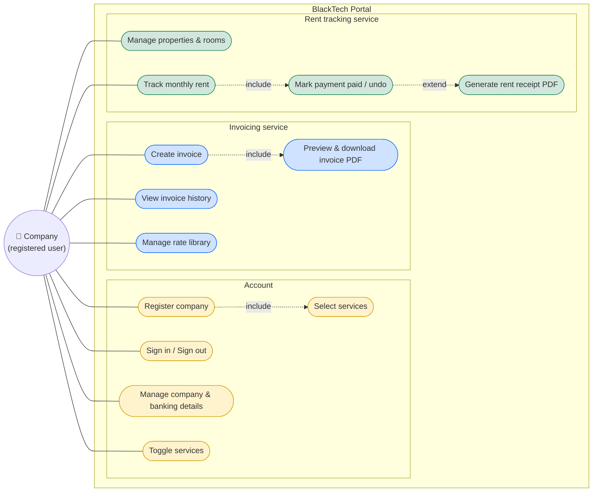

# BlackTech Portal

A multi-tenant ASP.NET Core 8 Razor Pages app. A company registers once
(**one login = one company**) and chooses the services it needs — **Invoicing**,
**Rent tracking**, or both. The app only exposes the features for the services a
company has enabled, and each company's data is fully isolated.

## Use cases

- **Account** use cases are always available. `Register company` *includes* selecting at least one service; services can be changed later via `Toggle services`.
- **Invoicing** and **Rent tracking** use cases are only reachable when the company has enabled that service (enforced server-side and reflected in the navigation).

See [`docs/use-cases.md`](docs/use-cases.md) for the end-to-end flow diagram, and
[`CLAUDE.md`](CLAUDE.md) for architecture, build/run commands, and the
multi-tenancy/auth model.
