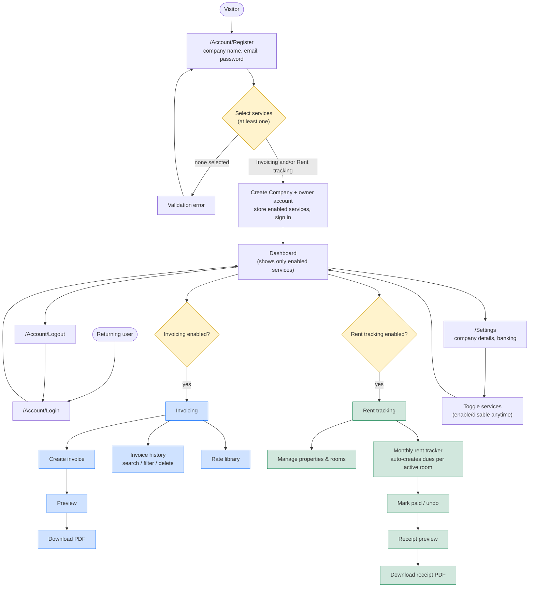

# Use cases — registration & per-company services

A company registers once (one login = one company) and selects the services it
needs: **Invoicing**, **Rent tracking**, or both. The app then only exposes the
features for the services that company enabled. Services can be toggled later in
Settings.

## Notes
- **One login = one company.** The account *is* the tenant; all data is isolated per company.
- **Service gating** is enforced server-side by `RequireServiceFilter` on the `/Invoices` and `/Rent` folders, and visually by hiding nav/dashboard cards for disabled services.
- **Settings is always available** (no service gate) so a company can turn a service on or off at any time.
